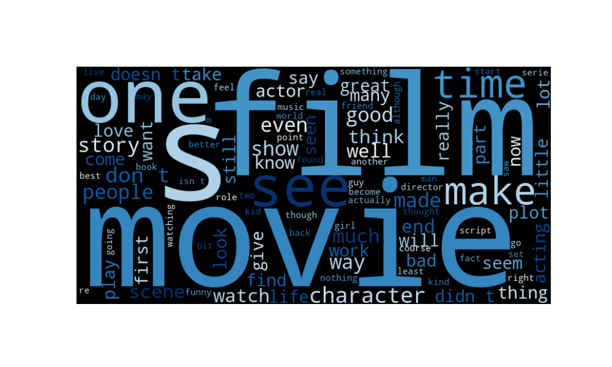

# 🎬 IMDB Movie Review Sentiment Analysis


## 🍿 Project Overview
This project focuses on sentiment classification using the IMDB dataset, which includes 50,000 highly polar movie reviews. The goal is to build a model that can accurately classify movie reviews as positive or negative, leveraging both traditional and deep learning approaches.

## 📊 Dataset Summary
The IMDB dataset consists of:
- **50,000 movie reviews** labeled as either positive or negative.
- **Training set**: 25,000 reviews
- **Testing set**: 25,000 reviews

More information about the dataset is available [here](https://www.kaggle.com/datasets/lakshmi25npathi/imdb-dataset-of-50k-movie-reviews/data).

## 🎯 Objectives
- **Binary Sentiment Classification**: Predict whether a review is positive or negative.

## 📂 Project Structure
- `data/`: Contains the IMDB dataset.
- `Movie_Review_Logistic_Regression.ipynb`: Model with Logistic Regression
- `Movie_Review_Neural_Networks.ipynb` :Model with Neural Netowrks
- `README.md`: Project documentation.

## 🔍 Methodology
1. **Data Preprocessing**: Steps to clean and prepare text data for modeling.


2. **Exploratory Data Analysis (EDA)**: Insights into the distribution and structure of the dataset.

```python
# Generate a word cloud from all reviews
wordcloud = WordCloud(width=800, height=400, background_color='black', colormap='Blues', max_words=100).generate(' '.join(df['cleaned_reviews']))

plt.imshow(wordcloud, interpolation='bilinear')
plt.axis('off')
plt.show()

```


(Note: This is the error handling im going to use through all the models)
```python
y_pred = model.predict(X_test_tfidf)
print(f"Accuracy: {accuracy_score(y_test, y_pred)}")
print(classification_report(y_test, y_pred))
```

if you have additional questions about this metrics check [📺 Introduction to Precision, Recall and F1](https://www.youtube.com/watch?v=jJ7ff7Gcq344)!

3. **Modeling**:
   - Logistic Regression
```python
# Import the TF-IDF Vectorizer from sklearn's feature extraction module
vectorizer = TfidfVectorizer(max_features=5000, stop_words='english')  

# Transform the training text data into TF-IDF features
# 'max_features=5000' limits the vocabulary to the 5,000 most important words
# 'stop_words="english"' removes common English words (like "the", "is") to focus on meaningful words
X_train_tfidf = vectorizer.fit_transform(X_train)

# Transform the test text data using the same fitted vectorizer
# This ensures that the same vocabulary and weight calculations are applied to the test data
X_test_tfidf = vectorizer.transform(X_test)
```
Metrics
```
Accuracy: 0.8884


              precision    recall  f1-score   support

          -1       0.90      0.87      0.89      4961
           1       0.88      0.91      0.89      5039

    accuracy                           0.89     10000
   macro avg       0.89      0.89      0.89     10000
weighted avg       0.89      0.89      0.89     10000


```
(This project uses logistic regression for binary sentiment classification. Logistic regression is a common algorithm for binary classification tasks, working by estimating probabilities to classify data into categories. If you’re interested in learning more about how logistic regression works, this video provides an excellent overview: [📺 Watch: Introduction to Logistic Regression](https://www.youtube.com/watch?v=EKm0spFxFG4)
)
   - Deep learning models
```python

```

## 📈 Results
- ****

## 📚 Key Learnings
- ****

## 🚀 Future Improvements
- ****
## 📜 References
- [Dataset Source](link_to_dataset_source)
- Additional resources on NLP and sentiment analysis.


## 🤝 Contributing
Feel free to contribute! Please fork the repository and submit a pull request. You can also open an issue if you find a bug or have a suggestion.

## 📄 License

This project is licensed under the MIT License. See the LICENSE file for more details.
