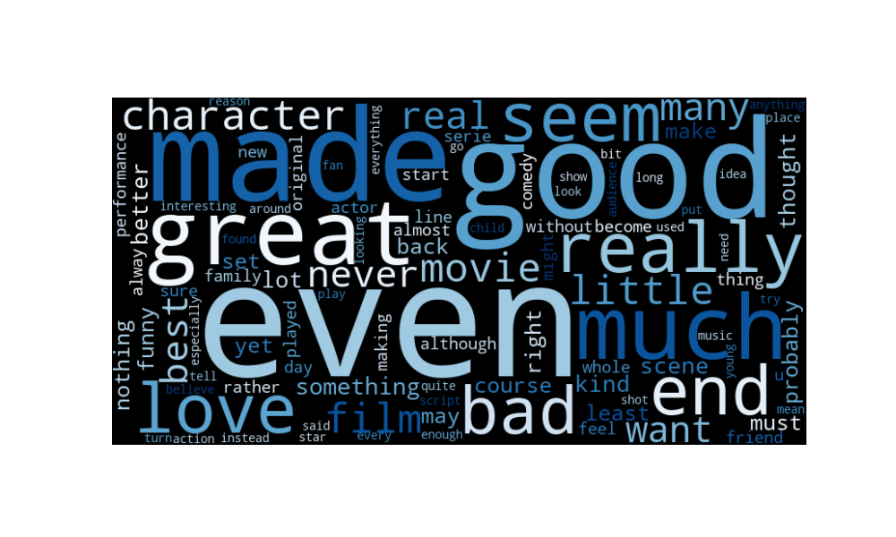

# 🎬 IMDB Movie Review Sentiment Analysis


## 🍿 Project Overview
This project focuses on sentiment classification using the IMDB dataset, which includes 50,000 highly polar movie reviews. The goal is to build a model that can accurately classify movie reviews as positive or negative, leveraging both traditional and deep learning approaches.

## 📊 Dataset Summary
The IMDB dataset consists of:
- **50,000 movie reviews** labeled as either positive or negative.
- **Training set**: 25,000 reviews
- **Testing set**: 25,000 reviews

More information about the dataset is available [here](https://www.kaggle.com/datasets/lakshmi25npathi/imdb-dataset-of-50k-movie-reviews/data).

## 🎯 Objectives
- **Binary Sentiment Classification**: Predict whether a review is positive or negative.

## 📂 Project Structure
- `data/`: Contains the IMDB dataset.
- `Movie_Review_Logistic_Regression.ipynb`: Model with Logistic Regression
- `Movie_Review_Neural_Networks.ipynb` :Model with Neural Netowrks
- `README.md`: Project documentation.

## 🔍 Methodology
1. **Data Preprocessing**: 
- I noticed the dataframe got HTML code inside on the reviews, so I cleaned it, also converted values like good and bad to 1 and 0

```python
def clean_text(text):
    text = re.sub('<br />', ' ', text)  
    text = re.sub('[^a-zA-Z]', ' ', text)  
    return text.lower()


df['cleaned_reviews'] = df['review'].apply(clean_text)


df = df.drop('review', axis=1)

df['sentiment'] = df['sentiment'].map({'positive': 1, 'negative': 0})
```


2. **Exploratory Data Analysis (EDA)**: Insights into the distribution and structure of the dataset.

```python
# Generate a word cloud from all reviews
wordcloud = WordCloud(width=800, height=400, background_color='black', colormap='Blues', max_words=100).generate(' '.join(df['cleaned_reviews']))

plt.imshow(wordcloud, interpolation='bilinear')
plt.axis('off')
plt.show()

```


(Note: This is the error handling im going to use through all the models)
```python
y_pred = model.predict(X_test_tfidf)
print(f"Accuracy: {accuracy_score(y_test, y_pred)}")
print(classification_report(y_test, y_pred))
```

if you have additional questions about this metrics check [📺 Introduction to Precision, Recall and F1](https://www.youtube.com/watch?v=jJ7ff7Gcq344)!

3. **Modeling**:
- ### 📊 Logistic Regression
```python
model = LogisticRegression()
```
Metrics
```
Accuracy: 0.8884

              precision    recall  f1-score   support

          -1       0.90      0.87      0.89      4961
           1       0.88      0.91      0.89      5039

    accuracy                           0.89     10000
   macro avg       0.89      0.89      0.89     10000
weighted avg       0.89      0.89      0.89     10000
```
   - Our logistic Regression looks quite good from the start, it is clear that while it missed a few ones, mostly is a good model with minor mistakes

      - (This project uses logistic regression for binary sentiment classification. Logistic regression is a common algorithm for binary classification tasks, working by estimating probabilities to classify data into categories. If you’re interested in learning more about how logistic regression works, this video provides an excellent overview: [📺 Watch: Introduction to Logistic Regression](https://www.youtube.com/watch?v=EKm0spFxFG4))


   - ### 🌳 Decision Trees
   ```python
   model = DecisionTreeClassifier(random_state=1)
   ```
Metrics
```
Accuracy: 0.7206

              precision    recall  f1-score   support

           0       0.72      0.72      0.72      4961
           1       0.72      0.72      0.72      5039

    accuracy                           0.72     10000
   macro avg       0.72      0.72      0.72     10000
weighted avg       0.72      0.72      0.72     10000
```
   - Looks like Decision Trees performed worse that Logistic Regression, in this case, the model doesn´t look outstanding, but get the job done.

   - ### 🌲 Random Forest
   ```python
   model = DecisionTreeClassifier(random_state=1)
   ```
Metrics
```
Accuracy: 0.8481
              precision    recall  f1-score   support

           0       0.84      0.86      0.85      4961
           1       0.86      0.83      0.85      5039

    accuracy                           0.85     10000
   macro avg       0.85      0.85      0.85     10000
weighted avg       0.85      0.85      0.85     10000
```
   - While Decision Trees performance was quite underwhelming, our random forest got a good performance, showing it can handle both seen and unseen data.

   - ### 💻 Deep Learning Models


```python
# clean code still on development
```
```
Accuracy: 0.8596
              precision    recall  f1-score   support

           0       0.84      0.89      0.86      4961
           1       0.88      0.83      0.86      5039

    accuracy                           0.86     10000
   macro avg       0.86      0.86      0.86     10000
weighted avg       0.86      0.86      0.86     10000
```
- I really liked the performance of the Neural Networks, but I think I can get more accuracy with more tweaks

## 📈 Results
- **Decision Trees vs Logistic Regression:**: Although decision trees often excel in classification tasks, logistic regression achieved a higher accuracy in this project. This is likely due to the high dimensionality of the vectorized text data, which logistic regression handles well with its linear nature, whereas decision trees can struggle without additional tuning.
- **The Data set is actually pretty good for modeling:**: The data proved to be well-suited for modeling, as shown by the satisfactory results across multiple algorithms. Clean and balanced data can significantly impact model performance, reducing preprocessing and enhancing predictive power.

## 📚 Key Learnings
- **Attention is all you need:**  The TF-IDF vectorization and word cloud visualization highlighted the review structure, effectively capturing key words and phrases. Understanding how to represent text data is crucial for model success, as feature engineering greatly impacts model performance.
- **Are Neural Networks Powerhouses?:** Neural networks demonstrated their potential as powerful models, but they also need careful tuning to reach optimal performance. Layer configuration, dropout, activation functions, and regularization all play a role in achieving the best results.

## 📜 References
- [Dataset Source](link_to_dataset_source)
- [Introduction to Logistic Regression](https://www.youtube.com/watch?v=EKm0spFxFG4)
- [Introduction to Precision, Recall and F1](https://www.youtube.com/watch?v=jJ7ff7Gcq344)


## 🤝 Contributing
Feel free to contribute! Please fork the repository and submit a pull request. You can also open an issue if you find a bug or have a suggestion.

## 📄 License

This project is licensed under the MIT License. See the LICENSE file for more details.
